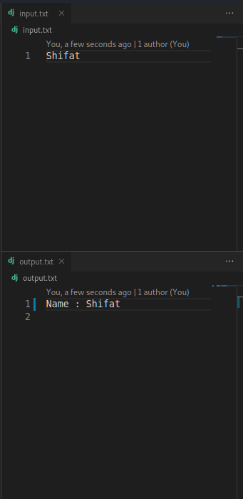
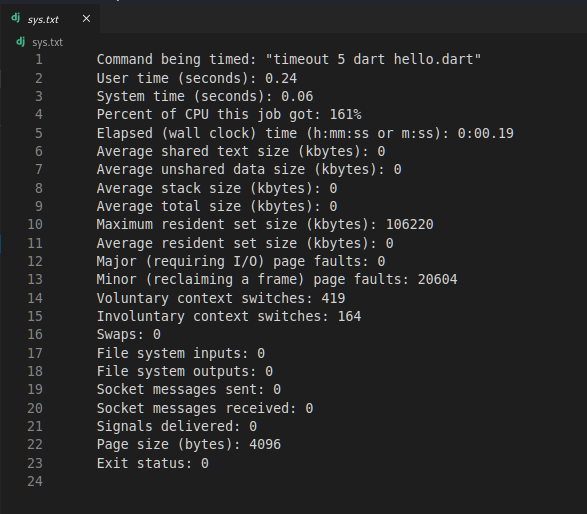

# Make Coding Easy
**This tutorial is for linux (debian based) only <br>
If you are a windows user then check this out [Setup VS Code for windows](https://github.com/jspw/VS-Code-Config/blob/master/readme(windows).md)**


# 1. **VS code task config** to make **competitive programming** easy and **programme ananlysis** ! <br> 

[This](/Config-Files/C%20&%20C++/Linux/task.json) is a **.json** file which will help you to run your **cpp** file with one **click** or **shortcut**.


In this case , you **don't** need to write **input** in the command line or write **fopen** / **close** stuffs , programme will take input from a file **(input.txt)** automatically and give the output in another file **(output.txt)** .



You can also find the programme **runtime status** which will help  you to calculate **execution time** as well as **memory usage** and many more !  


pre-requirments :
- Visual Studio Code
- gcc/g++
- time 
  - install time : ```sudo apt install time```

## Let's setup :
Note : **You just need to do these things only for the first time of your workspace!**

- Split screen in 3 sections 

  - split the main section in right (right mouse click on the .cpp file and u will get the split options)
  - then split the right into down (same as above)


- create a file named `input.txt` and save it in the same folder 
- create a file named `output.txt` and save it in the same folder 
- open input.txt into the upper right section
- open output.txt into the lower right section

#### This will be the final look of your vs code :


### How to setup :
- Go to Configure Default Build Task...
  - In Menu bar 
     - Clik on Terminal (At the left top bar )
     
    - select configure task
    - select create task.json from template (this will create a task.json file in .vscode in your working directory)
    - select other and new task.json file will be created
    - now copy and paste the `task.json` { [link is here](/Config-Files/C%20&%20C++/Linux'/tasks.json) }   file into your `task.json` file
    - done
    
## Usage :
- Run : 
  - Shortcut type : **`ctrl+shift+b`** 
- You need to give the input in the **input.txt** file
- output will be shown in the **output.txt** file


- **Bonus** : programme status will be shown in the **sys.txt** file 
- People concern about more details such as **binary form** and **disassemble code** can check `tasks(extra).json`  file [Link](/Config-Files/C%20&%20C++/Linux/tasks(extra).json)

# In the Repository i have also added *config* files for other Programming Languages too :
- **task.json** files for :

  - Python : 

    - [Windows File](Config-Files/Python/Windows/tasks.json)
    - [Linux File](Config-Files/Python/Linux/tasks.json)


  - Java : 

    - [Windows File](Config-Files/Java/Windows/tasks.json)
    - [Linux File](Config-Files/Java/Linux/tasks.json)

  - Dart : 
  
    - [Windows File](Config-Files/Dart/Windows/tasks.json)
    - [Linux File](Config-Files/Dart/Linux/tasks.json)

# 2. VS CODE Snippet 
**This one is made for my personal usage ,you can add functions as you wish and edit my name and doc**

  - Select User Snippets under **File** (at Left top bar) > **Preferences (Code > Preferences on macOS)**, and then select **cpp.json** 
  
  - copy or replace the cpp.json file {[Link](</Snippets/cpp.json>)} and save !

## Usage :
- Creating a cpp file if you type **inc**  and press **Tab**  in your keyboard the **snippet** will load as i have set **prefix** as **inc** in my **json file** . (**You can edit as your own !**)
- This will make programming easy and fast .


# In the Repository i have also added *config* files for other Programming Languages too :
- **Snippets** for :

  - [Python](/Snippets/python.json)
  - [Dart](/Snippets/dart.json)
  - [Java]() **To be added**

## Happy Coding with VS Code
