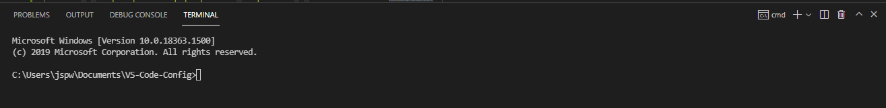
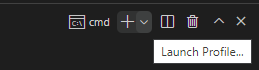
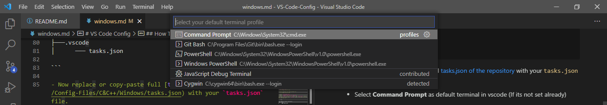
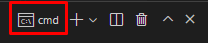

# VS Code Config

## Intro
This repository is about how to install and setup vs code for **competitive programming (actually easy input & output)** with **c/c++** for **windows** users.

**Note for old users of this repo :** There were some problems with bash in windows, so i had to convert the `tasks.json` file for cmd (Command Prompt). If you are using this new [json file](./Config-Files/C&C++/Windows/tasks.json) then, please select **cmd** as default  profile for vscode terminal.

## How To Configure

**Note :** You just need to do these things only for the first time of your workspace!

### Pre-requirments

Need VS Code and C++ Compiler mingw installed in your windows pc.

#### Installing VS Code

- [Download & Install](https://­code.visualstudio.com)

#### Installing mingw

- [Download & Install](https://osdn.net/projects/mingw/downloads/68260/mingw-get-setup.exe/)

### Seting Up Environment For C/C++

- In you pc search for **system environment**

  

- Go to **Environment variables** (on advance section)

  

- On **system varibale** section, select **path**. Then click edit, select new & paste the link of  your **mingw bin** folder. (Most probably its  in `C:\MinGW\bin`, find it. For me it is `C:\MinGW\bin`)

  

- Select ok>ok>apply>ok for everything.


#### Test MinGW path setup is working

- Open cmd and type gcc and hit enter
- If you find 

  ```
  gcc: fatal error: no input files
  compilation terminated.

  ```

  or something like that then congrats :3 

- else if you cmd says : 

  ```
  'gcc' is not recognized as an internal or external command,
  operable program or batch file.

  ```

  Then go back to the [Install mingw](#installing-mingw) and check everything again.


### Setup VS Code

- In VS Code, Open your coding folder (From Menu bar :  `file->open folder` )
  

- Clik on terminal (At the top Menu bar)
  

- Select `configure task..`
- Select `create task.json from template`
- Select `others` and it will create a new `tasks.json` file in your default folder under `.vscode` folder. The folder structure will be like this : 

```.tree

Your Default Folder (Workspace)
├───.vscode
│      ─── tasks.json

```

- Now replace or copy-paste full [tasks.json of the repository](./Config-Files/C&C++/Windows/tasks.json) with your `tasks.json` file.

#### Select **Command Prompt** as default terminal in vscode (If its not set already)

    

  - open terminal in vs code

  - at the right side of terminal window section there are some options like default terminal name (mine is already cmd), + v, split terminal sign,delete, ^, x. Select `v` beside `+` sign.

    

  - select `select default profile`

    

  - a select prompt will pop up at the top and select `command prompt`
    

  - close terminal clicking on delete icon

    

  - then reopen terminal and you will find cmd as your default terminal. 

    

- Done :D

#### More things to do

- Split screen in 3 sections
  - split the main section in right (right click of mouse on a file and u will get the split options)
  - then split the right section into up-down (same as below)
  
- create a file named `input.txt`
- create a file named `output.txt`
- open input.txt into the upper right section
- open output.txt into the lower right section

This will be the final look of your vs code : 

  


## How To Use

Create your .cpp file, write code and give inputs in input.txt and press `Ctrl+Shift+b` and your output will be in the output.txt file.

**Note :** Make sure your mouse corsor is **clicked** or **focused** on the **cpp file** editor while you are running your code.

In the Repository i have also added _config_ files for other Programming Languages too :

- **tasks.json** files for :

  - Python :

    - [Windows File](Config-Files/Python/Windows/tasks.json)
    - [Linux File](Config-Files/Python/Linux/tasks.json)

  - Java :

    - [Windows File](Config-Files/Java/Windows/tasks.json)
    - [Linux File](Config-Files/Java/Linux/tasks.json)

  - Dart :

    - [Windows File](Config-Files/Dart/Windows/tasks.json)
    - [Linux File](Config-Files/Dart/Linux/tasks.json)


# VS CODE Snippet

**This one is made for my personal usage ,you can add functions as you wish and edit my name and doc**


## Setup

- Select User Snippets (at top menubar, File/Code [for **mac**] > Perferences > User Snippets) and then select **cpp.json**.
  
- copy or replace the  [cpp.json file](./Snippets/cpp.json) and save.

## Usage :

- Creating a cpp file if you type **inc** and press **Tab** in your keyboard the **snippet** will load as i have set **prefix** as **inc** in my **json file** . (**You can edit as your own !**)
- This will make programming easy and fast .

## Snippets

  - [Python](/Snippets/python.json)
  - [Dart](/Snippets/dart.json)
  - [Java]() **To be added**

Happy coding :3
